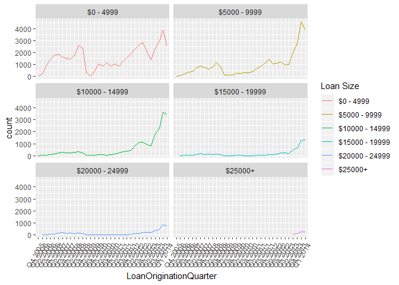

<h1>
Udacity EDA Project
</h1>
Prosper is a peer-to-peer lending marketplace headquartered in San Francisco, CA.

    ## 'data.frame':    113937 obs. of  81 variables:
    ##  $ ListingKey                         : Factor w/ 113066 levels "00003546482094282EF90E5",..: 7180 7193 6647 6669 6686 6689 6699 6706 6687 6687 ...
    ##  $ ListingNumber                      : int  193129 1209647 81716 658116 909464 1074836 750899 768193 1023355 1023355 ...
    ##  $ ListingCreationDate                : Factor w/ 113064 levels "2005-11-09 20:44:28.847000000",..: 14184 111894 6429 64760 85967 100310 72556 74019 97834 97834 ...
    ##  $ CreditGrade                        : Factor w/ 9 levels "","A","AA","B",..: 5 1 8 1 1 1 1 1 1 1 ...
    ##  $ Term                               : int  36 36 36 36 36 60 36 36 36 36 ...
    ##  $ LoanStatus                         : Factor w/ 12 levels "Cancelled","Chargedoff",..: 3 4 3 4 4 4 4 4 4 4 ...
    ##  $ ClosedDate                         : Factor w/ 2803 levels "","2005-11-25 00:00:00",..: 1138 1 1263 1 1 1 1 1 1 1 ...
    ##  $ BorrowerAPR                        : num  0.165 0.12 0.283 0.125 0.246 ...
    ##  $ BorrowerRate                       : num  0.158 0.092 0.275 0.0974 0.2085 ...
    ##  $ LenderYield                        : num  0.138 0.082 0.24 0.0874 0.1985 ...
    ##  $ EstimatedEffectiveYield            : num  NA 0.0796 NA 0.0849 0.1832 ...
    ##  $ EstimatedLoss                      : num  NA 0.0249 NA 0.0249 0.0925 ...
    ##  $ EstimatedReturn                    : num  NA 0.0547 NA 0.06 0.0907 ...
    ##  $ ProsperRating..numeric.            : int  NA 6 NA 6 3 5 2 4 7 7 ...
    ##  $ ProsperRating..Alpha.              : Factor w/ 8 levels "","A","AA","B",..: 1 2 1 2 6 4 7 5 3 3 ...
    ##  $ ProsperScore                       : num  NA 7 NA 9 4 10 2 4 9 11 ...
    ##  $ ListingCategory..numeric.          : int  0 2 0 16 2 1 1 2 7 7 ...
    ##  $ BorrowerState                      : Factor w/ 52 levels "","AK","AL","AR",..: 7 7 12 12 25 34 18 6 16 16 ...
    ##  $ Occupation                         : Factor w/ 68 levels "","Accountant/CPA",..: 37 43 37 52 21 43 50 29 24 24 ...
    ##  $ EmploymentStatus                   : Factor w/ 9 levels "","Employed",..: 9 2 4 2 2 2 2 2 2 2 ...
    ##  $ EmploymentStatusDuration           : int  2 44 NA 113 44 82 172 103 269 269 ...
    ##  $ IsBorrowerHomeowner                : Factor w/ 2 levels "False","True": 2 1 1 2 2 2 1 1 2 2 ...
    ##  $ CurrentlyInGroup                   : Factor w/ 2 levels "False","True": 2 1 2 1 1 1 1 1 1 1 ...
    ##  $ GroupKey                           : Factor w/ 707 levels "","00343376901312423168731",..: 1 1 335 1 1 1 1 1 1 1 ...
    ##  $ DateCreditPulled                   : Factor w/ 112992 levels "2005-11-09 00:30:04.487000000",..: 14347 111883 6446 64724 85857 100382 72500 73937 97888 97888 ...
    ##  $ CreditScoreRangeLower              : int  640 680 480 800 680 740 680 700 820 820 ...
    ##  $ CreditScoreRangeUpper              : int  659 699 499 819 699 759 699 719 839 839 ...
    ##  $ FirstRecordedCreditLine            : Factor w/ 11586 levels "","1947-08-24 00:00:00",..: 8639 6617 8927 2247 9498 497 8265 7685 5543 5543 ...
    ##  $ CurrentCreditLines                 : int  5 14 NA 5 19 21 10 6 17 17 ...
    ##  $ OpenCreditLines                    : int  4 14 NA 5 19 17 7 6 16 16 ...
    ##  $ TotalCreditLinespast7years         : int  12 29 3 29 49 49 20 10 32 32 ...
    ##  $ OpenRevolvingAccounts              : int  1 13 0 7 6 13 6 5 12 12 ...
    ##  $ OpenRevolvingMonthlyPayment        : num  24 389 0 115 220 1410 214 101 219 219 ...
    ##  $ InquiriesLast6Months               : int  3 3 0 0 1 0 0 3 1 1 ...
    ##  $ TotalInquiries                     : num  3 5 1 1 9 2 0 16 6 6 ...
    ##  $ CurrentDelinquencies               : int  2 0 1 4 0 0 0 0 0 0 ...
    ##  $ AmountDelinquent                   : num  472 0 NA 10056 0 ...
    ##  $ DelinquenciesLast7Years            : int  4 0 0 14 0 0 0 0 0 0 ...
    ##  $ PublicRecordsLast10Years           : int  0 1 0 0 0 0 0 1 0 0 ...
    ##  $ PublicRecordsLast12Months          : int  0 0 NA 0 0 0 0 0 0 0 ...
    ##  $ RevolvingCreditBalance             : num  0 3989 NA 1444 6193 ...
    ##  $ BankcardUtilization                : num  0 0.21 NA 0.04 0.81 0.39 0.72 0.13 0.11 0.11 ...
    ##  $ AvailableBankcardCredit            : num  1500 10266 NA 30754 695 ...
    ##  $ TotalTrades                        : num  11 29 NA 26 39 47 16 10 29 29 ...
    ##  $ TradesNeverDelinquent..percentage. : num  0.81 1 NA 0.76 0.95 1 0.68 0.8 1 1 ...
    ##  $ TradesOpenedLast6Months            : num  0 2 NA 0 2 0 0 0 1 1 ...
    ##  $ DebtToIncomeRatio                  : num  0.17 0.18 0.06 0.15 0.26 0.36 0.27 0.24 0.25 0.25 ...
    ##  $ IncomeRange                        : Factor w/ 8 levels "$0","$1-24,999",..: 4 5 7 4 3 3 4 4 4 4 ...
    ##  $ IncomeVerifiable                   : Factor w/ 2 levels "False","True": 2 2 2 2 2 2 2 2 2 2 ...
    ##  $ StatedMonthlyIncome                : num  3083 6125 2083 2875 9583 ...
    ##  $ LoanKey                            : Factor w/ 113066 levels "00003683605746079487FF7",..: 100337 69837 46303 70776 71387 86505 91250 5425 908 908 ...
    ##  $ TotalProsperLoans                  : int  NA NA NA NA 1 NA NA NA NA NA ...
    ##  $ TotalProsperPaymentsBilled         : int  NA NA NA NA 11 NA NA NA NA NA ...
    ##  $ OnTimeProsperPayments              : int  NA NA NA NA 11 NA NA NA NA NA ...
    ##  $ ProsperPaymentsLessThanOneMonthLate: int  NA NA NA NA 0 NA NA NA NA NA ...
    ##  $ ProsperPaymentsOneMonthPlusLate    : int  NA NA NA NA 0 NA NA NA NA NA ...
    ##  $ ProsperPrincipalBorrowed           : num  NA NA NA NA 11000 NA NA NA NA NA ...
    ##  $ ProsperPrincipalOutstanding        : num  NA NA NA NA 9948 ...
    ##  $ ScorexChangeAtTimeOfListing        : int  NA NA NA NA NA NA NA NA NA NA ...
    ##  $ LoanCurrentDaysDelinquent          : int  0 0 0 0 0 0 0 0 0 0 ...
    ##  $ LoanFirstDefaultedCycleNumber      : int  NA NA NA NA NA NA NA NA NA NA ...
    ##  $ LoanMonthsSinceOrigination         : int  78 0 86 16 6 3 11 10 3 3 ...
    ##  $ LoanNumber                         : int  19141 134815 6466 77296 102670 123257 88353 90051 121268 121268 ...
    ##  $ LoanOriginalAmount                 : int  9425 10000 3001 10000 15000 15000 3000 10000 10000 10000 ...
    ##  $ LoanOriginationDate                : Factor w/ 1873 levels "2005-11-15 00:00:00",..: 426 1866 260 1535 1757 1821 1649 1666 1813 1813 ...
    ##  $ LoanOriginationQuarter             : Factor w/ 33 levels "Q1 2006","Q1 2007",..: 18 8 2 32 24 33 16 16 33 33 ...
    ##  $ MemberKey                          : Factor w/ 90831 levels "00003397697413387CAF966",..: 11071 10302 33781 54939 19465 48037 60448 40951 26129 26129 ...
    ##  $ MonthlyLoanPayment                 : num  330 319 123 321 564 ...
    ##  $ LP_CustomerPayments                : num  11396 0 4187 5143 2820 ...
    ##  $ LP_CustomerPrincipalPayments       : num  9425 0 3001 4091 1563 ...
    ##  $ LP_InterestandFees                 : num  1971 0 1186 1052 1257 ...
    ##  $ LP_ServiceFees                     : num  -133.2 0 -24.2 -108 -60.3 ...
    ##  $ LP_CollectionFees                  : num  0 0 0 0 0 0 0 0 0 0 ...
    ##  $ LP_GrossPrincipalLoss              : num  0 0 0 0 0 0 0 0 0 0 ...
    ##  $ LP_NetPrincipalLoss                : num  0 0 0 0 0 0 0 0 0 0 ...
    ##  $ LP_NonPrincipalRecoverypayments    : num  0 0 0 0 0 0 0 0 0 0 ...
    ##  $ PercentFunded                      : num  1 1 1 1 1 1 1 1 1 1 ...
    ##  $ Recommendations                    : int  0 0 0 0 0 0 0 0 0 0 ...
    ##  $ InvestmentFromFriendsCount         : int  0 0 0 0 0 0 0 0 0 0 ...
    ##  $ InvestmentFromFriendsAmount        : num  0 0 0 0 0 0 0 0 0 0 ...
    ##  $ Investors                          : int  258 1 41 158 20 1 1 1 1 1 ...

    ##                ListingKey ListingNumber           ListingCreationDate
    ## 1 1021339766868145413AB3B        193129 2007-08-26 19:09:29.263000000
    ## 2 10273602499503308B223C1       1209647 2014-02-27 08:28:07.900000000
    ## 3 0EE9337825851032864889A         81716 2007-01-05 15:00:47.090000000
    ## 4 0EF5356002482715299901A        658116 2012-10-22 11:02:35.010000000
    ## 5 0F023589499656230C5E3E2        909464 2013-09-14 18:38:39.097000000
    ## 6 0F05359734824199381F61D       1074836 2013-12-14 08:26:37.093000000
    ##   CreditGrade Term LoanStatus          ClosedDate BorrowerAPR BorrowerRate
    ## 1           C   36  Completed 2009-08-14 00:00:00     0.16516       0.1580
    ## 2               36    Current                         0.12016       0.0920
    ## 3          HR   36  Completed 2009-12-17 00:00:00     0.28269       0.2750
    ## 4               36    Current                         0.12528       0.0974
    ## 5               36    Current                         0.24614       0.2085
    ## 6               60    Current                         0.15425       0.1314
    ##   LenderYield EstimatedEffectiveYield EstimatedLoss EstimatedReturn
    ## 1      0.1380                      NA            NA              NA
    ## 2      0.0820                 0.07960        0.0249         0.05470
    ## 3      0.2400                      NA            NA              NA
    ## 4      0.0874                 0.08490        0.0249         0.06000
    ## 5      0.1985                 0.18316        0.0925         0.09066
    ## 6      0.1214                 0.11567        0.0449         0.07077
    ##   ProsperRating..numeric. ProsperRating..Alpha. ProsperScore
    ## 1                      NA                                 NA
    ## 2                       6                     A            7
    ## 3                      NA                                 NA
    ## 4                       6                     A            9
    ## 5                       3                     D            4
    ## 6                       5                     B           10
    ##   ListingCategory..numeric. BorrowerState    Occupation EmploymentStatus
    ## 1                         0            CO         Other    Self-employed
    ## 2                         2            CO  Professional         Employed
    ## 3                         0            GA         Other    Not available
    ## 4                        16            GA Skilled Labor         Employed
    ## 5                         2            MN     Executive         Employed
    ## 6                         1            NM  Professional         Employed
    ##   EmploymentStatusDuration IsBorrowerHomeowner CurrentlyInGroup
    ## 1                        2                True             True
    ## 2                       44               False            False
    ## 3                       NA               False             True
    ## 4                      113                True            False
    ## 5                       44                True            False
    ## 6                       82                True            False
    ##                  GroupKey              DateCreditPulled
    ## 1                         2007-08-26 18:41:46.780000000
    ## 2                                   2014-02-27 08:28:14
    ## 3 783C3371218786870A73D20 2007-01-02 14:09:10.060000000
    ## 4                                   2012-10-22 11:02:32
    ## 5                                   2013-09-14 18:38:44
    ## 6                                   2013-12-14 08:26:40
    ##   CreditScoreRangeLower CreditScoreRangeUpper FirstRecordedCreditLine
    ## 1                   640                   659     2001-10-11 00:00:00
    ## 2                   680                   699     1996-03-18 00:00:00
    ## 3                   480                   499     2002-07-27 00:00:00
    ## 4                   800                   819     1983-02-28 00:00:00
    ## 5                   680                   699     2004-02-20 00:00:00
    ## 6                   740                   759     1973-03-01 00:00:00
    ##   CurrentCreditLines OpenCreditLines TotalCreditLinespast7years
    ## 1                  5               4                         12
    ## 2                 14              14                         29
    ## 3                 NA              NA                          3
    ## 4                  5               5                         29
    ## 5                 19              19                         49
    ## 6                 21              17                         49
    ##   OpenRevolvingAccounts OpenRevolvingMonthlyPayment InquiriesLast6Months
    ## 1                     1                          24                    3
    ## 2                    13                         389                    3
    ## 3                     0                           0                    0
    ## 4                     7                         115                    0
    ## 5                     6                         220                    1
    ## 6                    13                        1410                    0
    ##   TotalInquiries CurrentDelinquencies AmountDelinquent
    ## 1              3                    2              472
    ## 2              5                    0                0
    ## 3              1                    1               NA
    ## 4              1                    4            10056
    ## 5              9                    0                0
    ## 6              2                    0                0
    ##   DelinquenciesLast7Years PublicRecordsLast10Years
    ## 1                       4                        0
    ## 2                       0                        1
    ## 3                       0                        0
    ## 4                      14                        0
    ## 5                       0                        0
    ## 6                       0                        0
    ##   PublicRecordsLast12Months RevolvingCreditBalance BankcardUtilization
    ## 1                         0                      0                0.00
    ## 2                         0                   3989                0.21
    ## 3                        NA                     NA                  NA
    ## 4                         0                   1444                0.04
    ## 5                         0                   6193                0.81
    ## 6                         0                  62999                0.39
    ##   AvailableBankcardCredit TotalTrades TradesNeverDelinquent..percentage.
    ## 1                    1500          11                               0.81
    ## 2                   10266          29                               1.00
    ## 3                      NA          NA                                 NA
    ## 4                   30754          26                               0.76
    ## 5                     695          39                               0.95
    ## 6                   86509          47                               1.00
    ##   TradesOpenedLast6Months DebtToIncomeRatio    IncomeRange
    ## 1                       0              0.17 $25,000-49,999
    ## 2                       2              0.18 $50,000-74,999
    ## 3                      NA              0.06  Not displayed
    ## 4                       0              0.15 $25,000-49,999
    ## 5                       2              0.26      $100,000+
    ## 6                       0              0.36      $100,000+
    ##   IncomeVerifiable StatedMonthlyIncome                 LoanKey
    ## 1             True            3083.333 E33A3400205839220442E84
    ## 2             True            6125.000 9E3B37071505919926B1D82
    ## 3             True            2083.333 6954337960046817851BCB2
    ## 4             True            2875.000 A0393664465886295619C51
    ## 5             True            9583.333 A180369302188889200689E
    ## 6             True            8333.333 C3D63702273952547E79520
    ##   TotalProsperLoans TotalProsperPaymentsBilled OnTimeProsperPayments
    ## 1                NA                         NA                    NA
    ## 2                NA                         NA                    NA
    ## 3                NA                         NA                    NA
    ## 4                NA                         NA                    NA
    ## 5                 1                         11                    11
    ## 6                NA                         NA                    NA
    ##   ProsperPaymentsLessThanOneMonthLate ProsperPaymentsOneMonthPlusLate
    ## 1                                  NA                              NA
    ## 2                                  NA                              NA
    ## 3                                  NA                              NA
    ## 4                                  NA                              NA
    ## 5                                   0                               0
    ## 6                                  NA                              NA
    ##   ProsperPrincipalBorrowed ProsperPrincipalOutstanding
    ## 1                       NA                          NA
    ## 2                       NA                          NA
    ## 3                       NA                          NA
    ## 4                       NA                          NA
    ## 5                    11000                      9947.9
    ## 6                       NA                          NA
    ##   ScorexChangeAtTimeOfListing LoanCurrentDaysDelinquent
    ## 1                          NA                         0
    ## 2                          NA                         0
    ## 3                          NA                         0
    ## 4                          NA                         0
    ## 5                          NA                         0
    ## 6                          NA                         0
    ##   LoanFirstDefaultedCycleNumber LoanMonthsSinceOrigination LoanNumber
    ## 1                            NA                         78      19141
    ## 2                            NA                          0     134815
    ## 3                            NA                         86       6466
    ## 4                            NA                         16      77296
    ## 5                            NA                          6     102670
    ## 6                            NA                          3     123257
    ##   LoanOriginalAmount LoanOriginationDate LoanOriginationQuarter
    ## 1               9425 2007-09-12 00:00:00                Q3 2007
    ## 2              10000 2014-03-03 00:00:00                Q1 2014
    ## 3               3001 2007-01-17 00:00:00                Q1 2007
    ## 4              10000 2012-11-01 00:00:00                Q4 2012
    ## 5              15000 2013-09-20 00:00:00                Q3 2013
    ## 6              15000 2013-12-24 00:00:00                Q4 2013
    ##                 MemberKey MonthlyLoanPayment LP_CustomerPayments
    ## 1 1F3E3376408759268057EDA             330.43            11396.14
    ## 2 1D13370546739025387B2F4             318.93                0.00
    ## 3 5F7033715035555618FA612             123.32             4186.63
    ## 4 9ADE356069835475068C6D2             321.45             5143.20
    ## 5 36CE356043264555721F06C             563.97             2819.85
    ## 6 874A3701157341738DE458F             342.37              679.34
    ##   LP_CustomerPrincipalPayments LP_InterestandFees LP_ServiceFees
    ## 1                      9425.00            1971.14        -133.18
    ## 2                         0.00               0.00           0.00
    ## 3                      3001.00            1185.63         -24.20
    ## 4                      4091.09            1052.11        -108.01
    ## 5                      1563.22            1256.63         -60.27
    ## 6                       351.89             327.45         -25.33
    ##   LP_CollectionFees LP_GrossPrincipalLoss LP_NetPrincipalLoss
    ## 1                 0                     0                   0
    ## 2                 0                     0                   0
    ## 3                 0                     0                   0
    ## 4                 0                     0                   0
    ## 5                 0                     0                   0
    ## 6                 0                     0                   0
    ##   LP_NonPrincipalRecoverypayments PercentFunded Recommendations
    ## 1                               0             1               0
    ## 2                               0             1               0
    ## 3                               0             1               0
    ## 4                               0             1               0
    ## 5                               0             1               0
    ## 6                               0             1               0
    ##   InvestmentFromFriendsCount InvestmentFromFriendsAmount Investors
    ## 1                          0                           0       258
    ## 2                          0                           0         1
    ## 3                          0                           0        41
    ## 4                          0                           0       158
    ## 5                          0                           0        20
    ## 6                          0                           0         1

This huge dataset contains 113,937 loans made with 81 variables. Further elaboration of each variable can be found here (<https://docs.google.com/spreadsheets/d/1gDyi_L4UvIrLTEC6Wri5nbaMmkGmLQBk-Yx3z0XDEtI/edit#gid=0>).

    ##    Category     x
    ## 1      2005    22
    ## 2      2006  5906
    ## 3      2007 11460
    ## 4      2008 11552
    ## 5      2009  2047
    ## 6      2010  5652
    ## 7      2011 11228
    ## 8      2012 19553
    ## 9      2013 34345
    ## 10     2014 12172

To get a sense of loan activity across the timespan of this data set, I plotted the count of loans across all recorded quarters. 2 major dips (over a span of at least 2 quarters) can be observed.

The first one started in Q2 2008 and lasted until Q2 2009. This period was also when the 2008 global financial crisis was at its peak and probably also had an impact on borrowing activity. In fact it seemed that there was a temporary shutdown in the first quarter of 2009 with no loans being listed. A quick check on Wikipedia reveals that Prosper received a cease and desist order in late 2008 and had to obtain SEC registration for its loan before relaunching their website on July 2009.

The second dip occurred in the last 2 quarters of 2012. This could be due to Quantitative Easing measures implemented by the Fed amidst the Eurozone Debt Crisis. This lowered interest rates and probably made it cheaper to borrow elsewhere.

Overall, Prosper has seen robust growth, recovering from the financial crisis by 2011 and then more than tripling the number of loans from 2011 - 2013.

Notes: To get a sense of the geographical distribution of the loans, I plotted the counts of loans in all US States. The States with the most loans are California, Texas, New York, Florida and Illinois.

The rankings in this chart also roughly mirror that of economy size. I.e. The bigger the state's economy, the more loans are made. There might also be more loans in California because that's where Prosper orignates from and has the best market penetration. This would have to be corroborated with other loan datasets.

Notes: I was curious if borrowing activity was driven by first-time borrowers or repeat borrowers. I sorted the dataset in descending order against the listing dates, converted the N/A value to 0 and then subsetted the dataset to remove duplicate entries of repeated borrowers. Since the dataset was already rearranged, total prosper loans would be reflected from data of the latest loans.

It seems like most people are first-time borrowers and recurring borrowing activity is not a feature of the platform. Apart from people might try to keep their loans to the minimum, this might also be due to the fact that peer-to-peer lending is relatively new and so most people have only had short exposure to it.

Notes: Overwhelming majority of loans were listed with the stated reason of Debt Consolidation. From what was observed in the previous visualisation, it seems that users are using Prosper to consolidate loans from other sources (since most users are one time borrowers). Perhaps Prosper offers better interest rates. Interesting to note that the next two biggest categories are 'Not Available' and 'Other' which obscures any clear reason.

Notes: The 2 occupations that have the greatest counts (Other and Professional) are also the most ambiguous options. People might have selected this option because they feel their occupation is not accurately captured by other optionns or that they do not feel comfortable disclosing this detail. Given its ambiguity, it doesn't seem to be a impactful data point.

Notes: I wanted to understand if there was a 'social' element to investing in Prosper loans, which might be differentiate it from other mediums and could be a useful growth mechanism. To my surprise, it seems the case that investing in loans on Prosper is a very individualistic decision. Most investments do not have participation from friends. Or effective mechanisms have not been built to track friend participation.

Notes: In terms of amounts borrowed, it seems that people tend to borrow in multiples of $5000 in larger sums (&gt;$5000) or multiples of $1000 in smaller sums ($5000=&lt;). Accordingly, I went ahead to bucket loans $5000 multiples to use for further analysis.

Notes: This collection of graphs show how loans of different sizes grew overtime.

In the earlier years, small loans of less than $5000 were the primary driver of growth. Probably due to the novelty of an online loan marketplace, people were more inclined to experiment with it in smaller amounts of money.

However since 2012, bigger loans (5000 - 15000) started to gain popularity, possibly as a consequence of people looking for alternative sources of funding after the financial crisis.

The success of bigger loan sizes might have encouraged a larger maximum limit to loans. As can be observed, from 2013, loan size in excess of 25000 was introduced. If indeed bigger loans on Prosper are becoming more mainstream, this points to exciting future possiblities for the platform.

    ##
    ## FALSE  TRUE
    ## 27814 86123

Notes: I was curious about how diverse the investor base for loans of different sizes. To my surprise, a quarter of all loans have only 1 investor. There is however a long tail of loans with a wide range of investors in terms of numbers.

Generally, loans of all sizes are funded by a numerical spectrum of investors. That said, for loans that are larger, there tends to be more investors that participate in that investment. So loans that have ~50 investors or less are usually below $5000, loans that have ~125 investors tend to be bigger (5000 - 9999), loans that have ~250 investors tend to be bigger (10000 - 14999) and so on.

(The above plot excludes loans that have only 1 investor so that detail in the long tail can be more explicit.)

    ## # A tibble: 8 x 4
    ## # Groups:   CreditGrade [8]
    ##   CreditGrade LoanStatus count  prop
    ##   <fct>       <fct>      <int> <dbl>
    ## 1 AA          Completed   2969 0.846
    ## 2 A           Completed   2505 0.756
    ## 3 B           Completed   2987 0.681
    ## 4 C           Completed   3609 0.639
    ## 5 D           Completed   3126 0.607
    ## 6 E           Completed   1678 0.510
    ## 7 HR          Completed   1372 0.391
    ## 8 NC          Completed     42 0.298

Notes: Credit Grading is an important concept in helping investor assess risks. I saw two sets of grades, one that applied pre-2009 and one after. I wanted to find out how each grade-set performed. Starting with credit grading pre-2009.

Looking at how different Credit Grades performed in the past, the proportion of completed loans gets progressively larger as one goes from NC - AA. Loans seem to be normally distributed with C loans having the biggest volume being the average grade and NC loans have the least volume which makes sense, since they are a category that is least likely to return the loan.

    ## # A tibble: 7 x 4
    ## # Groups:   ProsperRating..Alpha. [7]
    ##   ProsperRating..Alpha. LoanStatus count  prop
    ##   <fct>                 <fct>      <int> <dbl>
    ## 1 AA                    Completed   1700 0.934
    ## 2 A                     Completed   3203 0.844
    ## 3 B                     Completed   2785 0.755
    ## 4 C                     Completed   2977 0.685
    ## 5 D                     Completed   4192 0.660
    ## 6 E                     Completed   2506 0.591
    ## 7 HR                    Completed   2301 0.570

Notes: New Prosper Ratings seem to have a couple of additional Status categories. Majority of loans are still current, so this subset might be excluded for analysis of performance.

Excluding current loans, the new grade set indicates better performance across all grades as compared to the previous credit grading. This is definitely a step in the right direction.

    ## ProsperRating..Alpha.: AA
    ##    Min. 1st Qu.  Median    Mean 3rd Qu.    Max.
    ## 0.03000 0.05990 0.06790 0.06911 0.07450 0.20000
    ## --------------------------------------------------------
    ## ProsperRating..Alpha.: A
    ##    Min. 1st Qu.  Median    Mean 3rd Qu.    Max.
    ##  0.0398  0.0890  0.1019  0.1029  0.1139  0.2050
    ## --------------------------------------------------------
    ## ProsperRating..Alpha.: B
    ##    Min. 1st Qu.  Median    Mean 3rd Qu.    Max.
    ##  0.0593  0.1314  0.1409  0.1444  0.1539  0.3400
    ## --------------------------------------------------------
    ## ProsperRating..Alpha.: C
    ##    Min. 1st Qu.  Median    Mean 3rd Qu.    Max.
    ##  0.0795  0.1665  0.1814  0.1844  0.1999  0.3400
    ## --------------------------------------------------------
    ## ProsperRating..Alpha.: D
    ##    Min. 1st Qu.  Median    Mean 3rd Qu.    Max.
    ##  0.1057  0.2187  0.2392  0.2364  0.2525  0.3400
    ## --------------------------------------------------------
    ## ProsperRating..Alpha.: E
    ##    Min. 1st Qu.  Median    Mean 3rd Qu.    Max.
    ##  0.1379  0.2612  0.2825  0.2833  0.3049  0.3400
    ## --------------------------------------------------------
    ## ProsperRating..Alpha.: HR
    ##    Min. 1st Qu.  Median    Mean 3rd Qu.    Max.
    ##  0.1679  0.3034  0.3077  0.3073  0.3077  0.3400

Notes: From an investor/lender's perspective, Prosper Ratings is an important factor in determining yield. Riskier loans have higher yields as can be observed from the boxplot and stat summaries above.

Notes: Did a quick ggpairs on a select set of variables and a sample set of 10000 observations for me to scan for useful correlations to analyse.

Notes: It can be observed that from here that the 2 income brackets that are most active in taking loans are the middle brackets $25000-49999 bracket and the $50000-74999 bracket. Loans that go to lower income or indeterminiate income brackets makes less loans on the platform and tend to have a lower completion rate.

    ## IncomeRange: Not displayed
    ##    Min. 1st Qu.  Median    Mean 3rd Qu.    Max.    NA's
    ##   0.000   0.090   0.160   0.297   0.260  10.010     124
    ## --------------------------------------------------------
    ## IncomeRange: Not employed
    ##    Min. 1st Qu.  Median    Mean 3rd Qu.    Max.    NA's
    ##   0.010   0.160   0.295   3.328  10.010  10.010     728
    ## --------------------------------------------------------
    ## IncomeRange: $0
    ##    Min. 1st Qu.  Median    Mean 3rd Qu.    Max.    NA's
    ##      NA      NA      NA     NaN      NA      NA     621
    ## --------------------------------------------------------
    ## IncomeRange: $1-24,999
    ##    Min. 1st Qu.  Median    Mean 3rd Qu.    Max.    NA's
    ##   0.020   0.190   0.320   0.737   0.500  10.010     913
    ## --------------------------------------------------------
    ## IncomeRange: $25,000-49,999
    ##    Min. 1st Qu.  Median    Mean 3rd Qu.    Max.    NA's
    ##  0.0100  0.1700  0.2600  0.2789  0.3600  7.9000    2311
    ## --------------------------------------------------------
    ## IncomeRange: $50,000-74,999
    ##    Min. 1st Qu.  Median    Mean 3rd Qu.    Max.    NA's
    ##  0.0100  0.1600  0.2300  0.2457  0.3200 10.0100    1690
    ## --------------------------------------------------------
    ## IncomeRange: $75,000-99,999
    ##    Min. 1st Qu.  Median    Mean 3rd Qu.    Max.    NA's
    ##  0.0100  0.1400  0.2000  0.2137  0.2800  2.5500     901
    ## --------------------------------------------------------
    ## IncomeRange: $100,000+
    ##    Min. 1st Qu.  Median    Mean 3rd Qu.    Max.    NA's
    ##  0.0000  0.1200  0.1700  0.1806  0.2300 10.0100    1266

Notes: Higher income groups have lower median debt to income ratio and lower variances. I was slightly surprised at the latter statistic, thinking that people with higher income could take on more debt to finance bigger purchases and ventures whereas people in lower income groups would have to be generally more disciplined in their spending.

Notes: Income Range is an important aspect of Prosper Ratings. As can be observed, proportion of borrowers with good ratings consistently goes up in higher income brackets.

Notes: Some further illumination of Prosper Ratings. In general, the higher a borrower's rating, the bigger their loans. This is probably enforced by Prosper's platform. Interestingly, as loan amounts exceed $20000, AA borrowers become scarce. Perhaps, this is a characteristic of the most responsible borrowers where money is never borrowed excessively or lightly.

Also, given the same loan amount, borrowers with a higher Prosper rating tend to have a higher percentage of available credit. It makes sense that borrowers that have not exhausted their credit are less saddled with existing debt and more likely to be able to repay their loans.

For some reason, HR borrowers seem to make loans of ~$4000 regardless of credit utilization. Perhaps this is the most convenient amount available to them on Prosper, where higher amounts have disproportionately high interest rates.

Notes: Seems like there is no linear correlation between how much recommendations a loan listing gets and how much it gets funded. What can be observed is that loans that are fully funded tend to have 0 - 5 recommendations whilst loans that are not tend to have no recommendations.

Loan amounts seem to have some influence as to how much it is funded if the borrower has a rating of C and above, where bigger loans tend to be more incompletely funded. Inerestingly, the biggest loans (&gt;20000) seem to be better funded that those in the 10 - 20k range. This might be due to better returns for bigger loans, thus attracting more investment.

Notes: This last plot has less to do with Prosper as a platform. Rather, I was interested in exploring financial discipline on a slightly more macro level through understanding the relationship between availability of credit, delinquency and income. I was rather suprised by what I found, or the lack thereof.

This illustrates a whole spectrum of people with different payment/credit situations. (i.e there doesn't seem to be any correlation between how much credit is available and the amount of delinquency people can fall into)

The first is the line along the y-axis which seems to indicate a group of people that get into varying extents of delinquencies and have no available credit.

The second is the line along the x-axis which seems to indicate a group of people with healthy amounts of credit available and never miss a payment.

The third is a cluster in the center that indicates a whole range of people who have available credit but also miss their payments. It is to be noted that this cluster is more concentrated where amounts are larger (i.e. people tend to miss payments and have available credits in excess of thousands of dollars).

Also rather surprisingly, this spectrum applies to people regardless of income range. I suppose the positive takeaway is everyone, regardless of how much they earn strive to be closer to the x-axis.

<h1>
Final Plots
</h1>

Notes: Looking at loans post-2009 that have past their term, it is clear that Prosper Ratings are successful in determining whether a loan would be paid off. Prosper has constructed a helpful indicator that investors can count on in assessing risk.

Notes: Smaller loans (below $15000) are seeing rapid growth while bigger loans (above $15000) are starting to gain traction. Yet, this is but a fraction of the total loans made in the US. If this traction can be sustained, exciting times are ahead for the peer-to-peer lending industry and Prosper.

Notes: Prosper is not only growing the number and size of loans on its marketplace, it is also growing the quality of loans. Since 2013, A - C loans have increased much more rapidly than the other groups. In addition, HR loans have decreased. An interesting question though would be how Prosper would continue to sustain a wide spectrum of risk to attract investors who are looking for higher yields (since higher risk loans = higher yields).

<h1>
Reflections
</h1>
This was a fun exercise. Coming into this, I had no knowledge about loans, credits or how a p2p loan marketplace works. In trying to make sense of the data, I spent probably as much if not more time reading up on this space along with trying to hone my R skills. And while I appreciated more thoroughly how domain knowledge can be so valuable, I am definitely more confident in my skills to explore a dataset. I would like to compare this data with a wider loan dataset to understand how p2p lending is performing in a wider loan space, how Prosper loans compare as a loan option as compared to other platforms and mediums and how Prosper loans compare as an investment asset compared to other instruments. Statistics is helpful in looking back and understand what has happened, but I would also like to be able to use this data to be able to predict the risk of future loans.

Regretfully, while I did refer to numerous sources for help, it is only while writing this do I realise I did not save any of them. :(
